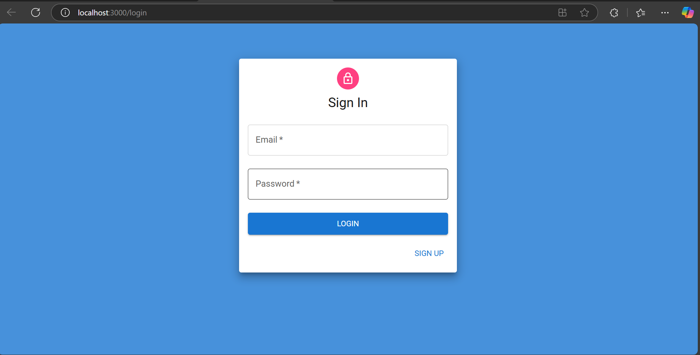
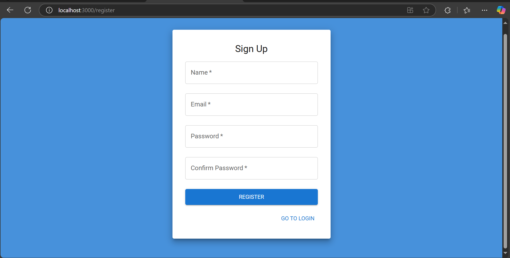
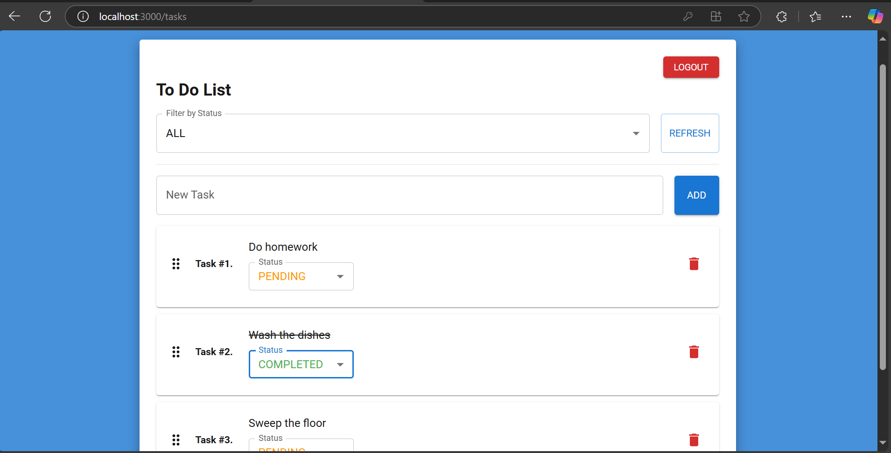
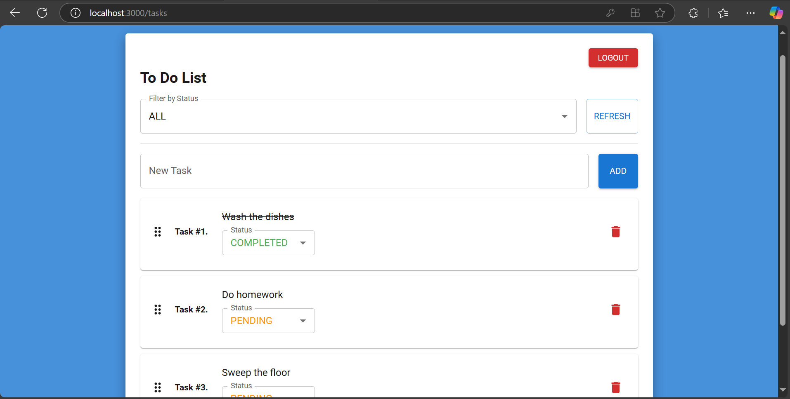
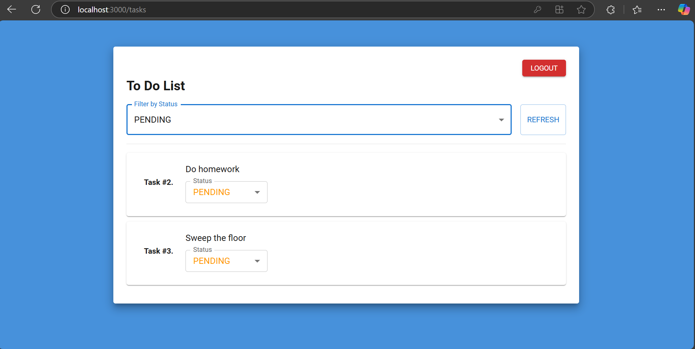

## Evaluation CT by #CTDesarrallo #Funiber

# To Do List App – Laravel (Backend) + React with MUI (Frontend)

This project is a To Do List application developed as part of a technical test for Funiber. It uses Laravel (PHP) for the backend REST API and React with Material UI (MUI) and @dnd-kit for the frontend interface. The app includes task management features such as task creation, deletion, reordering via drag-and-drop, and real-time updates to task order.

---

## Requirements

-   PHP >= 8.1
-   Composer
-   MySQL
-   Node.js >= 16
-   npm >= 7

---

## Backend Setup (Laravel)

### 1. Install dependencies

```bash
composer install
```

### 2. Create `.env` file

Linux

```bash
cp .env.example .env
```

Windows

```bash
copy .env.example .env
```

### 3. Set environment variables

Update your `.env` file in order to connect to your local database:
Create the database manually or wait to the 5th step

```
DB_CONNECTION=mysql
DB_HOST=127.0.0.1
DB_PORT=3306
DB_DATABASE=ct_candidates_db
DB_USERNAME=root
DB_PASSWORD=root
```

### 4. Generate application key

```bash
php artisan key:generate
```

### 5. Run migrations

```bash
php artisan migrate
```

Create the database if you dont have it

### 6. Serve the backend

```bash
php artisan serve
```

By default, Laravel will be available at: http://localhost:8000

---

## API Endpoints

The task-related endpoints will only return tasks associated with the authenticated user, based on the provided authorization token.

-   `POST /api/register` – register a user
-   `POST /api/login` – login and receive token
-   `GET /api/tasks` – fetch tasks (requires token)
-   `GET /api/tasks/{id}` – fetch tasks (requires token)
-   `POST /api/tasks` – create task (requires token)
-   `PUT /api/tasks/{id}` – update task (requires token)
-   `DELETE /api/tasks/{id}` – delete task (requires token)

**Authentication** uses Laravel Sanctum + token-based access.

---

## Frontend Setup (React)

### 1. Go to the frontend directory project

```bash
cd frontend
cd todo-frontend
```

### 2. Install dependencies

```bash
npm install
```

### 2. Create `.env` file

Linux

```bash
cp .env.example .env
```

Windows

```bash
copy .env.example .env
```

### 3. Start the development server

```bash
npm start
```

The frontend will be available at: http://localhost:3000

---

## Frontend Sections and Details

Login route

SignUp route

Todo List Home

Drag a task to order it

Filter tasks


## Main Functionalities

-   User registration and login with Laravel Sanctum
-   Authenticated task creation, viewing, update and delete
-   Drag & Drop reordering of tasks using `@dnd-kit`
-   Real-time sync of task `order`
-   Responsive UI with Material UI

---

## Notes

-   Ensure your backend (`php artisan serve`) is running before starting the frontend.
-   Tokens are stored in `localStorage` and used for authentication in API requests.
-   The task-related endpoints will only return tasks associated with the authenticated user, based on the provided authorization token.
-   To maintain consistency in the order of tasks, tasks can only be reordered and deleted in the ALL filter.
